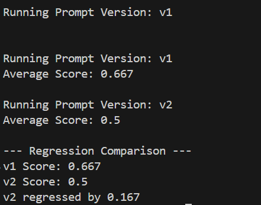

# 🚀 PromptGuard AI – LLM Prompt Quality & Regression Monitoring System  
License: MIT  
Tech: Python  
LLM Provider: Groq (llama-3.1-8b-instant)  
Interface: CLI (Expandable to Streamlit / FastAPI)

PromptGuard AI is an end-to-end proof-of-concept that automates evaluation, benchmarking, and regression detection for Large Language Model (LLM) prompts. Instead of manually inspecting outputs, this system compares multiple prompt versions against structured test cases and detects performance degradation before deployment.

---

## 🔎 Project Summary

Goal: Automate prompt benchmarking and detect quality regressions to ensure reliable LLM-based production systems.

Inputs:
- Prompt template versions (JSON-based)
- Structured test cases (input + evaluation rules)
- Evaluation constraints (word limit, hashtag count, tone)

Outputs:
- Generated LLM response
- Constraint compliance score (0–1 normalized)
- Average score per prompt version
- Regression detection (improved / regressed)
- CLI-based evaluation report

## 🛠️ Methodology (High Level)

1. Prompt Versioning  
Prompt templates are stored in a version-controlled JSON file.

Example:

{
  "v1": {
    "template": "Write a professional LinkedIn post about {topic}. Include 5 hashtags."
  },
  "v2": {
    "template": "Write a concise, engaging and professional LinkedIn post about {topic}. Use 3-5 relevant hashtags."
  }
}

Each version is evaluated independently against the same test dataset.

---

2. LLM Execution  
Model: llama-3.1-8b-instant 

For each test case:
- The prompt is formatted with input topic
- Sent to the Groq LLM
- Output text is collected for evaluation

---

3. Constraint-Based Evaluation  

Each generated output is evaluated against three constraints:

- Word count compliance (rule-based)
- Hashtag count compliance (regex-based)
- Professional tone validation (LLM-assisted Yes/No check)

Scoring System:
- Each satisfied constraint = 1 point
- Maximum score per test case = 3
- Final score normalized between 0 and 1

---

4. Regression Detection  

After evaluating all test cases:

Average Score = Total Points / Maximum Possible Points

If:

New Version Score < Previous Version Score

→ Regression detected.

This ensures prompt changes do not silently degrade quality.

---

## 📸 Demo Screenshot

  

## 📊 Example Output

Running Prompt Version: v1  
Average Score: 0.667  

Running Prompt Version: v2  
Average Score: 0.5  

--- Regression Comparison ---  
v1 Score: 0.667  
v2 Score: 0.5  
v2 regressed by 0.167  

Interpretation:
- v1 satisfied ~66.7% of defined constraints  
- v2 satisfied ~50% of defined constraints  
- The updated prompt reduced measurable output quality  

This prevents silent production degradation.

---

## 🏗️ System Architecture

Prompt Store (JSON)  
        ↓  
Test Case Loader  
        ↓  
LLM Runner (Groq)  
        ↓  
Constraint Evaluator  
        ↓  
Regression Comparator  
        ↓  
CLI Output Report  

Modular Components:
- app/llm_runner.py
- app/evaluator.py
- app/regression.py
- app/prompt_store.py
- main.py

---

## ⚙️ Tech Stack

- Python
- Groq LLM API
- python-dotenv
- JSON-based configuration
- Modular backend architecture

---

## 🎯 Why This Project Matters

This project demonstrates:

- LLM reliability engineering  
- Automated prompt benchmarking  
- Structured evaluation design  
- Regression detection logic  
- Production-aware AI system thinking  
 

---

## 🔮 Future Improvements

- JSON report export for CI/CD integration  
- Cost tracking per prompt version  
- Multi-model benchmarking  
- Web dashboard (Streamlit / FastAPI)  
- Git-based prompt diff visualization  

---

## 👤 Author

Keerthi Adapa  
Email: keerthiadapa70@gmail.com  
GitHub: https://github.com/Devikeerthi000
