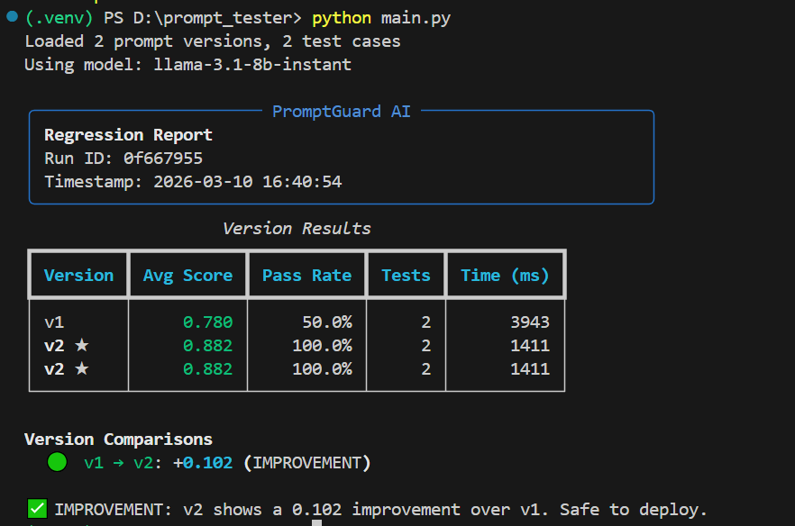

<div align="center">

# 🛡️ PromptGuard AI

**Enterprise-Grade LLM Prompt Quality & Regression Monitoring System**

[](https://www.python.org/downloads/)
[](https://github.com/astral-sh/ruff)
[](https://mypy-lang.org/)
[](https://pytest.org/)

*Automate prompt evaluation, benchmarking, and regression detection for production LLM systems.*

[Features](#-features) •
[Usage](#-usage) •
[Architecture](#-architecture) •
[Contributing](#-contributing)

</div>

---

## 📸 Demo

<p align="center">
  
</p>

---

## 🎯 Overview

PromptGuard AI is an end-to-end framework for automated prompt quality assurance. It enables teams to:

- **Benchmark** prompt versions against structured test cases
- **Detect** performance regressions before deployment
- **Evaluate** LLM outputs against configurable constraints
- **Track** prompt evolution with detailed metrics

Perfect for teams managing prompts in production who need confidence that changes won't degrade output quality.

## ✨ Features

| Feature | Description |
|---------|-------------|
| 🔄 **Version Comparison** | Compare multiple prompt versions side-by-side |
| 📊 **Regression Detection** | Automatically flag performance drops |
| 🎛️ **Flexible Evaluators** | Word count, hashtags, tone, and custom checks |
| 🔌 **Provider Agnostic** | Support for Groq, OpenAI, Anthropic |
| 📈 **Rich Reporting** | Beautiful CLI output with detailed metrics |
| 🧪 **Test Framework** | Comprehensive pytest test suite |
| 🔒 **Type Safe** | Full type hints with Pydantic models |

## 📖 Usage

### CLI Commands

#### Run Regression Tests

```bash
# Basic run with defaults
promptguard run

# Specify custom files
promptguard run --prompts data/my_prompts.json --tests data/my_tests.json

# Save report to file
promptguard run --output reports/regression_report.md

# Show detailed results
promptguard run --detailed

# Use different model
promptguard run --model llama-3.1-70b-versatile
```

#### Validate Configuration

```bash
# Validate prompt and test files
promptguard validate --prompts data/prompts.json --tests data/tests.json
```

#### Initialize New Project

```bash
# Create sample files in current directory
promptguard init

# Create in specific directory
promptguard init ./my-project
```

### Data Formats

#### Prompt Versions (`data/prompt_versions.json`)

```json
{
  "v1": {
    "template": "Write a professional LinkedIn post about {topic}. Include 5 hashtags.",
    "description": "Basic prompt"
  },
  "v2": {
    "template": "Write a concise, engaging LinkedIn post about {topic}. Use 3-5 relevant hashtags at the end.",
    "description": "Improved prompt with better instructions"
  }
}
```

#### Test Cases (`data/test_cases.json`)

```json
[
  {
    "input": "AI in healthcare",
    "expected_rules": {
      "max_words": 150,
      "must_have_hashtags": 5,
      "tone": "professional"
    },
    "tags": ["ai", "healthcare"]
  }
]
```

### Programmatic Usage

```python
from src.config.settings import get_settings
from src.providers.factory import create_provider
from src.evaluators.registry import get_default_evaluators
from src.data.store import PromptStore, TestCaseStore
from src.engine.runner import RegressionRunner
from src.engine.analyzer import RegressionAnalyzer

# Setup
settings = get_settings()
provider = create_provider()
evaluator = get_default_evaluators(provider)

# Load data
prompts = PromptStore("data/prompt_versions.json")
tests = TestCaseStore("data/test_cases.json")

# Run regression
runner = RegressionRunner(provider, evaluator)
report = runner.run_regression(prompts, tests)

# Analyze
analyzer = RegressionAnalyzer()
report = analyzer.analyze_report(report)
print(analyzer.get_recommendation(report))
```

## 🏗️ Architecture

```
promptguard-ai/
├── src/
│   ├── cli/              # Typer CLI application
│   │   ├── main.py       # CLI commands
│   │   └── utils.py      # CLI utilities
│   ├── config/           # Configuration management
│   │   └── settings.py   # Pydantic settings
│   ├── core/             # Core utilities
│   │   ├── exceptions.py # Custom exceptions
│   │   └── logging.py    # Logging setup
│   ├── data/             # Data loading
│   │   ├── loader.py     # File loaders
│   │   └── store.py      # Data stores
│   ├── engine/           # Regression engine
│   │   ├── runner.py     # Test runner
│   │   ├── analyzer.py   # Result analysis
│   │   └── reporter.py   # Report generation
│   ├── evaluators/       # Output evaluators
│   │   ├── base.py       # Abstract base
│   │   ├── word_count.py # Word count check
│   │   ├── hashtag.py    # Hashtag check
│   │   ├── tone.py       # LLM tone check
│   │   └── composite.py  # Combine evaluators
│   ├── models/           # Pydantic models
│   │   └── schemas.py    # Data schemas
│   └── providers/        # LLM providers
│       ├── base.py       # Abstract provider
│       ├── groq.py       # Groq implementation
│       └── factory.py    # Provider factory
├── tests/                # Pytest test suite
├── data/                 # Sample data files
├── pyproject.toml        # Project configuration
└── .pre-commit-config.yaml
```

### Key Design Patterns

- **Strategy Pattern**: Evaluators are interchangeable strategies
- **Factory Pattern**: Provider creation abstracted via factory
- **Composite Pattern**: Multiple evaluators combined into pipelines
- **Repository Pattern**: Data stores abstract file handling

## 🧪 Testing

```bash
# Run all tests
pytest

# Run with coverage
pytest --cov=src --cov-report=html

# Run specific test file
pytest tests/test_evaluators.py

# Run only unit tests
pytest -m unit

# Run with verbose output
pytest -v
```

## 🔧 Development

### Code Quality

```bash
# Format code
ruff format .

# Lint and fix
ruff check --fix .

# Type check
mypy src/

# Run pre-commit on all files
pre-commit run --all-files
```

### Adding New Evaluators

1. Create evaluator in `src/evaluators/`:

```python
from src.evaluators.base import BaseEvaluator, EvaluatorResult

class MyEvaluator(BaseEvaluator):
    @property
    def name(self) -> str:
        return "my_evaluator"
    
    def evaluate(self, text: str, **kwargs) -> EvaluatorResult:
        # Your evaluation logic
        return EvaluatorResult(
            name=self.name,
            passed=True,
            score=1.0,
            details={}
        )
```

2. Register in `src/evaluators/registry.py`:

```python
EvaluatorRegistry.register("my_evaluator", MyEvaluator)
```

### Adding New Providers

1. Implement `BaseLLMProvider` in `src/providers/`
2. Add to factory in `src/providers/factory.py`

## 📊 Evaluation Metrics

| Metric | Description | Scoring |
|--------|-------------|---------|
| Word Count | Text length compliance | Binary pass/partial credit |
| Hashtags | Required hashtag count | Proportional scoring |
| Tone | Professional tone check | LLM-based Yes/No |

### Regression Detection

- **Threshold**: Configurable (default 5%)
- **Comparison**: Sequential version pairs
- **Recommendation**: Auto-generated deployment advice

## 🤝 Contributing

1. Fork the repository
2. Create a feature branch (`git checkout -b feature/amazing`)
3. Make your changes
4. Run tests (`pytest`)
5. Run linting (`ruff check --fix .`)
6. Commit (`git commit -m 'feat: add amazing feature'`)
7. Push (`git push origin feature/amazing`)
8. Open a Pull Request

### Commit Convention

We follow [Conventional Commits](https://www.conventionalcommits.org/):

- `feat:` New feature
- `fix:` Bug fix
- `docs:` Documentation
- `style:` Formatting
- `refactor:` Code restructuring
- `test:` Tests
- `chore:` Maintenance

## � How Regression Detection Works

After evaluating all test cases:

$$\text{Average Score} = \frac{\text{Total Points}}{\text{Maximum Possible Points}}$$

If:

$$\text{New Version Score} < \text{Previous Version Score}$$

A **regression is detected** — ensuring prompt changes do not silently degrade quality.

## 📊 Example Output

```
Running Prompt Version: v1  →  Average Score: 0.667  
Running Prompt Version: v2  →  Average Score: 0.5  
⚠️ Regression detected: v2 scored lower than v1
```

---

<div align="center">

**Built with ❤️ for the AI Engineering Community**

</div>

--- Regression Comparison ---  
v1 Score: 0.667  
v2 Score: 0.5  
v2 regressed by 0.167  

Interpretation:
- v1 satisfied ~66.7% of defined constraints  
- v2 satisfied ~50% of defined constraints  
- The updated prompt reduced measurable output quality  

This prevents silent production degradation.

---

## 🏗️ System Architecture

Prompt Store (JSON)  
        ↓  
Test Case Loader  
        ↓  
LLM Runner (Groq)  
        ↓  
Constraint Evaluator  
        ↓  
Regression Comparator  
        ↓  
CLI Output Report  

Modular Components:
- app/llm_runner.py
- app/evaluator.py
- app/regression.py
- app/prompt_store.py
- main.py

---

## ⚙️ Tech Stack

- Python
- Groq LLM API
- python-dotenv
- JSON-based configuration
- Modular backend architecture

---

## 🎯 Why This Project Matters

This project demonstrates:

- LLM reliability engineering  
- Automated prompt benchmarking  
- Structured evaluation design  
- Regression detection logic  
- Production-aware AI system thinking  
 

---

## 🔮 Future Improvements

- JSON report export for CI/CD integration  
- Cost tracking per prompt version  
- Multi-model benchmarking  
- Web dashboard (Streamlit / FastAPI)  
- Git-based prompt diff visualization  

---

## 👤 Author

Keerthi Adapa  
Email: keerthiadapa70@gmail.com  
GitHub: https://github.com/Devikeerthi000
